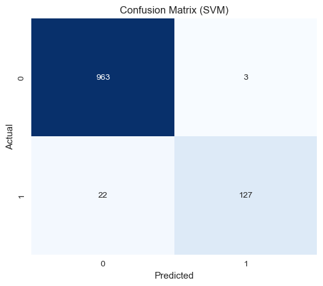
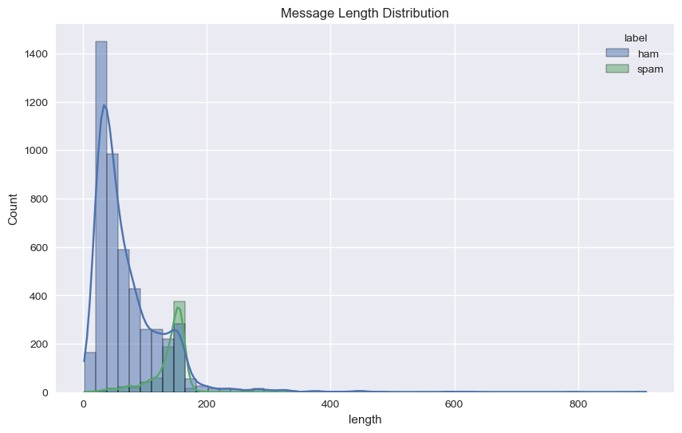

# SMS Spam Classification

Project to classify SMS messages as spam or ham.

### Problem

*   **Current state**: Too much spam (20%+).
*   **Impact**: Bad user experience, user churn, revenue loss.
*   **Goal**: Reduce spam to < 10% without blocking genuine messages (False Positives < 1%).

### Solution

We treat this as a supervised text classification problem.

*   **Evidence**: ML text classification is feasible and accurate for this scale.
*   **Approach**:
    1.  **Prep**: Clean text (regex), stratify split (60/20/20).
    2.  **Features**: TF-IDF (top 5000 words).
    3.  **Model**: Benchmark 3 models (NB, LR, SVM).

### Results

**Support Vector Machine (SVM)** was the best performer.

| Metric | Score | Why it matters |
| :--- | :--- | :--- |
| **Accuracy** | **98%** | Overall correctness. |
| **Spam Recall** | **0.91** | Catches 91% of actual spam. |
| **Spam Precision**| **0.97** | 97% of flagged messages are actually spam (Low False Positives). |

*Confusion matrix showing where the model makes mistakes.*

*Distribution of message lengths.*

### How to Run

1.  **Data**: 
    `python prepare.ipynb`
2.  **Model**: 
    `python train.ipynb`

