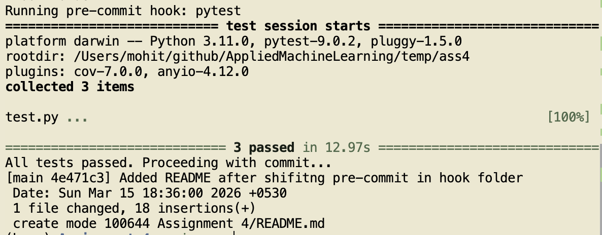

Assignment 4: Containerized Spam Classifier

This folder contains the Dockerized version of the Spam Classifier API.

Key files:
* Dockerfile: Instructions to build the container.
* app.py: The Flask API application (runs on port 5001).
* score.py: Core logic for scoring spam probability.
* test.py: Integration tests including test_docker() to verify the container.
* coverage.txt: Test coverage report generated by pytest.
* pre-commit: Git hook script to enforce tests passing before commits.
* requirements.txt: Required Python dependencies.
* best_model.pkl: The serialized machine learning model.

Instructions:
1. Build the image: docker build -t spam_classifier_app .
2. Run the container: docker run -d -p 5001:5001 --name spam_app spam_classifier_app
3. Run tests locally: pytest test.py

The below image shows the successful execution of the pre-commit pytest hook running automatically when committing code to the main branch:

