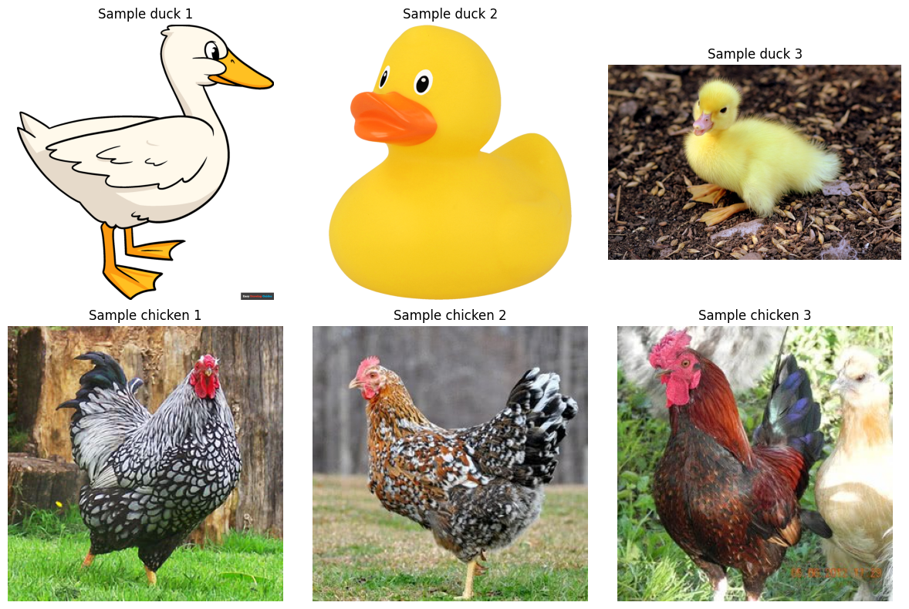
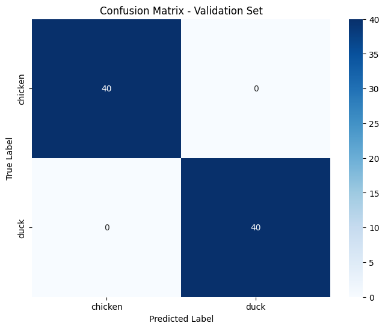
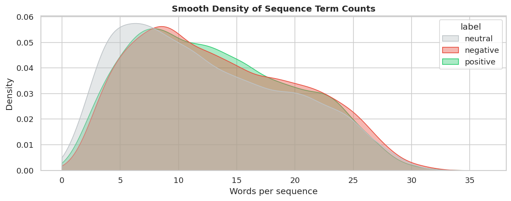
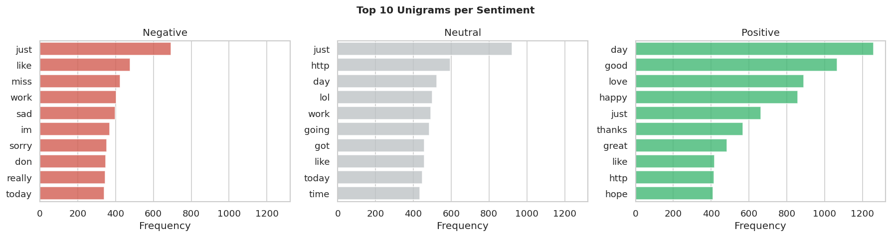
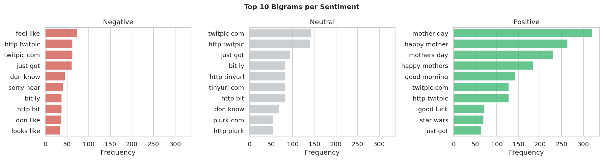
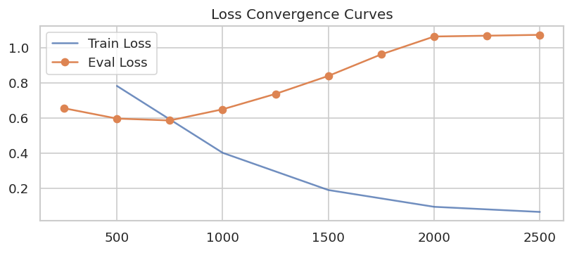
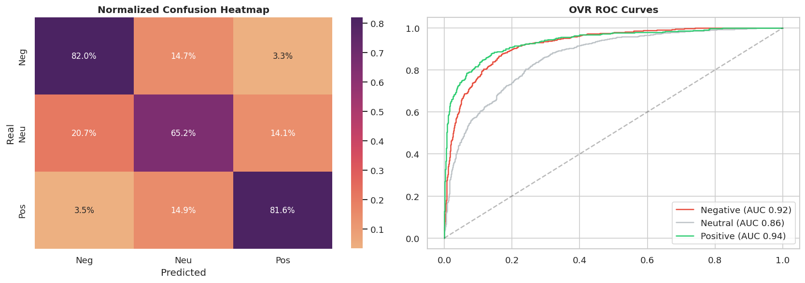
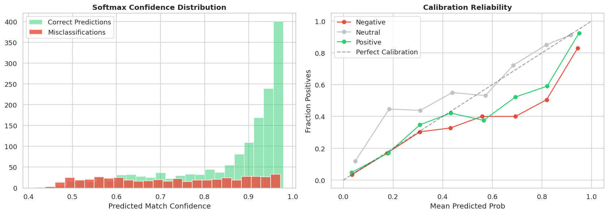

# Assignment 5: Transfer Learning

## Task 1: Image Classification (Duck vs. Chicken)

The goal of this task was to classify images of ducks and chickens. A pre-trained ResNet18 model was fine-tuned on custom datasets for this binary classification problem.

### Model Performance
The fine-tuned ResNet18 model reached 1.00 accuracy on the validation set.

**Final Validation Results (Epoch 9):**
- Validation Loss: 0.0261
- Validation Accuracy: 1.0000

**Classification Report:**
```text
              precision    recall  f1-score   support

     chicken       1.00      1.00      1.00        40
        duck       1.00      1.00      1.00        40

    accuracy                           1.00        80
   macro avg       1.00      1.00      1.00        80
weighted avg       1.00      1.00      1.00        80
```
The model easily separated the two classes, likely because ducks and chickens are visually distinct and ResNet18 provides strong base features. 

### Notebook Plots
Plots from the training process:




---

## Task 2: Sentiment Analysis

The goal of this task was to classify text into Negative, Neutral, or Positive sentiment using a Kaggle dataset. A baseline TF-IDF + Logistic Regression model was developed, followed by fine-tuning a transformer model (`distilbert-base-uncased`).

### Model Performance
DistilBERT outperformed the baseline TF-IDF model, increasing overall accuracy from 66% to 75%.

**Baseline TF-IDF + Logistic Regression:**
```text
              precision    recall  f1-score   support

    negative       0.60      0.68      0.64       550
     neutral       0.63      0.59      0.61       821
    positive       0.74      0.72      0.73       629

    accuracy                           0.66      2000
   macro avg       0.66      0.66      0.66      2000
```

**DistilBERT Fine-Tuned Performance:**
```text
              precision    recall  f1-score   support

    negative       0.70      0.82      0.76       550
     neutral       0.75      0.65      0.70       821
    positive       0.79      0.82      0.80       629

    accuracy                           0.75      2000
   macro avg       0.75      0.76      0.75      2000
```

Class weights were used during training to handle the dataset imbalance. This helped the model achieve 82% recall for both positive and negative classes. The model had the most trouble distinguishing neutral texts.

### Notebook Plots
EDA and evaluation plots from the notebook:







